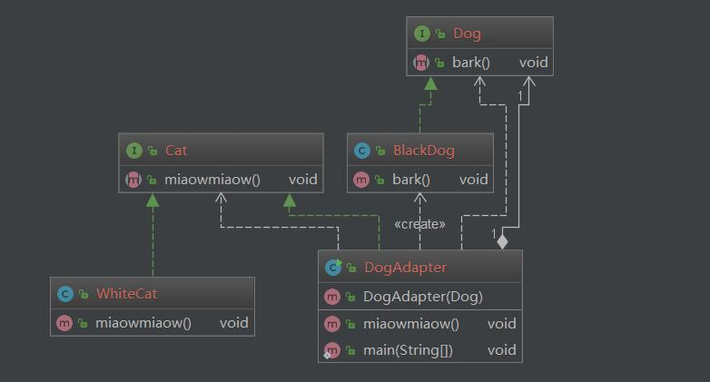

# 适配器模式 Adapter
___

## intent
适配器可以将一个类的接口转换为另外一个类的接口

##UML
<div align="center">  </div><br>

##Code

```java

public interface Cat {
    // cat miaowmiaow
    void miaowmiaow();
}


public interface Dog {
    // dog bark
    void bark();
}


public class BlackDog implements Dog {

    @Override
    public void bark() {
        System.out.println("Black Dog wang wang");
    }
}

public class WhiteCat implements Cat {

    @Override
    public void miaowmiaow() {
        System.out.println("white cat miaow miaow");
    }
}


// 将一只黑狗伪装成白猫

public class DogAdapter implements Cat {

    private Dog dog;
    public DogAdapter(Dog dog)
    {
        this.dog = dog;
    }
    @Override
    public void miaowmiaow() {
        dog.bark();
    }

    public static void main(String[] args) {
        Dog dog = new BlackDog();
        Cat cat = new DogAdapter(dog);
        cat.miaowmiaow();
    }
}


```
## 应用实例

- java.util.Arrays#asList()
- java.util.Collections#list()

##  参考文献

[adapter](https://java-design-patterns.com/patterns/adapter/)