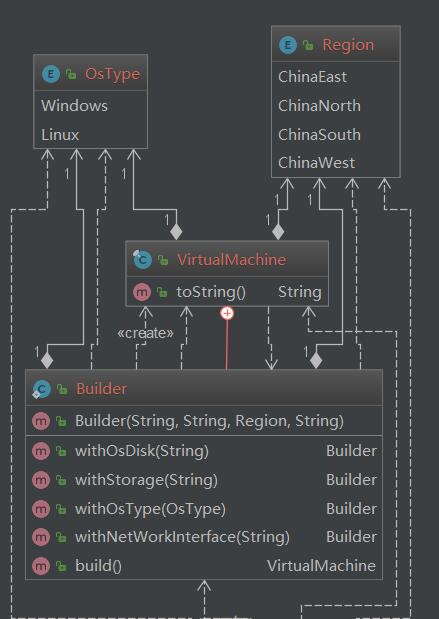

# 建造者模式  Builder Pattern
___
## Intent

将对象的构造与表示分离，已达到相同的构造过程可以提供不同的表示对象

## Explanation
> 不直接生成想要的对象，而是让客户端利用所有必要的参数调用构造器，得到一个builder对象，然后在builder上
> 调用类似于setter的方法，来设置每个相关的可选参数。


## Example
- 构造一个参数很多的对象超过

## UML

<div align="center">  </div><br>

## Code
```java
public final class VirtualMachine {

    private final String subscriptionId;
    private final String resourceGroup;
    private final Region region;
    private final String name;

    private final String osDisk;
    private final String storage;
    private final OsType osType;
    private final String networkInterface;

    private VirtualMachine(Builder builder)
    {
        this.subscriptionId = builder.subscriptionId;
        this.resourceGroup = builder.resourceGroup;
        this.region = builder.region;
        this.name = builder.name;
        this.osDisk = builder.osDisk;
        this.storage = builder.storage;
        this.osType = builder.osType;
        this.networkInterface = builder.networkInterface;
    }

    @Override
    public String toString() {
        return String.format("/subcriptionid/%s/region/%s/resourcegroup/%s/name/%s", subscriptionId, region, resourceGroup, name);
    }

    public static class Builder
    {
        private final String subscriptionId;
        private final String resourceGroup;
        private final Region region;
        private final String name;

        private  String osDisk;
        private  String storage;
        private  OsType osType;
        private  String networkInterface;
        public Builder(String subscriptionId, String resourceGroup, Region region, String name)
        {
            this.subscriptionId = subscriptionId;
            this.resourceGroup = resourceGroup;
            this.region = region;
            this.name = name;
        }

        public Builder withOsDisk(String osDisk)
        {
            this.osDisk = osDisk;
            return this;
        }

        public Builder withStorage(String storage)
        {
            this.storage =  storage;
            return this;
        }

        public Builder withOsType(OsType osType)
        {
            this.osType = osType;
            return this;
        }
        public Builder withNetWorkInterface(String netWorkInterface)
        {
            this.networkInterface = netWorkInterface;
            return this;
        }
        public VirtualMachine build()
        {
            return new VirtualMachine(this);
        }
    }

}
```

```java
public enum  Region {
    ChinaEast,ChinaNorth,ChinaSouth,ChinaWest
}


public enum OsType {
    Windows,Linux
}


```
## 生成对象
```
public class VirtualMachineDemo {

    public static void main(String[] args) {
        VirtualMachine vm = new VirtualMachine.Builder("subid","rg",Region.ChinaEast,"myVm")
                .withStorage("storage").withOsDisk("osdisk").withNetWorkInterface("networkinterface").withOsType(OsType.Linux).build();
        System.out.println(vm);
    }
}
```

## 优缺点
 -  参数过多（4个或者更多），未来可能还会增加参数，易于扩展
 -  增强可读性
 -  可能会导致性能问题,代码冗长
## 应用例子
- [StringBuilder](http://docs.oracle.com/javase/8/docs/api/java/lang/StringBuilder.html)
- [StringBuffer](http://docs.oracle.com/javase/8/docs/api/java/lang/StringBuffer.html#append-boolean-)
- java.nio.ByteBuffer as well as similar buffers such as FloatBuffer, IntBuffer and so on.

## 参考文献
- >[java-design-patterns](https://java-design-patterns.com/patterns/builder/)
- [builder-design-pattern-in-java](https://www.journaldev.com/1425/builder-design-pattern-in-java)
- Effective Java