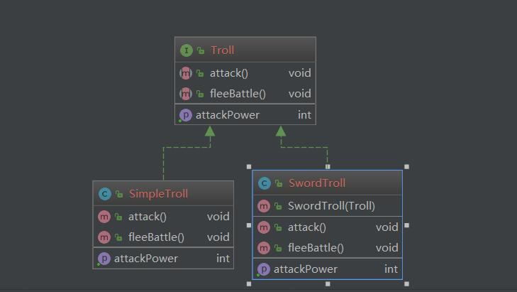

# 装饰器模式  Decorator Pattern
___
## Intent 

动态的给对象添加额外的职责，同时给子类扩展功能提供了灵活的选项。

## Explanation
装饰器模式允许你在运行时通过包装一个对象成为装饰器的对象来动态的改变对象的行为

## UML

<div align="center">  </div><br>
## Code

SwordTroll 对simpleTroll 进行包装/装饰，来增加额外的功能
### Interface
```java
public interface Troll {
    // attack you
    void attack();
    // run away from the battle
    void fleeBattle();

    int getAttackPower();
}
```

### SimpleTroll
```java
public class SimpleTroll implements Troll {
    private static final Logger logger = Logger.getLogger(SimpleTroll.class.getName());

    @Override
    public void attack() {
        logger.info("the troll try to attack you");
    }

    @Override
    public void fleeBattle() {
        logger.info("the troll runs away");
    }

    @Override
    public int getAttackPower() {
        return 10;
    }
}
```

### SwordTroll
```java
public class SwordTroll implements Troll {
    private static final Logger logger = Logger.getLogger(SwordTroll.class.getName());
     private Troll troll;
    public SwordTroll(Troll troll)
    {
        this.troll = troll;
    }
    @Override
    public void attack() {
        troll.attack();
        logger.info("the troll attack with you with a sword");
    }

    @Override
    public int getAttackPower() {
        return troll.getAttackPower() + 20;
    }

    @Override
    public void fleeBattle() {
        troll.fleeBattle();
    }
}
```

### Output
- 一月 27, 2019 10:31:06 上午 DesignPattern.Decorator.SimpleTroll attack
信息: the troll try to attack you
一月 27, 2019 10:31:06 上午 DesignPattern.Decorator.SimpleTroll fleeBattle
信息: the troll runs away
一月 27, 2019 10:31:06 上午 DesignPattern.Decorator.SimpleTroll attack
信息: the troll try to attack you
一月 27, 2019 10:31:06 上午 DesignPattern.Decorator.SwordTroll attack
信息: the troll attack with you with a sword
一月 27, 2019 10:31:06 上午 DesignPattern.Decorator.SimpleTroll fleeBattle
信息: the troll runs away

## Applicability
> 给单个对象动态的添加职责，而且并不影响其他的对象
> 
> 提前做某些准备工作，或者做善后工作


## Example
[java.util.Collections#synchronizedXXX()](https://docs.oracle.com/javase/8/docs/api/java/util/Collections.html#synchronizedCollection-java.util.Collection-)

## 参考文献

- [java-design-patterns](https://java-design-patterns.com/patterns/decorator/)
- [decorator-design-pattern-in-java-example](https://www.journaldev.com/1540/decorator-design-pattern-in-java-example)
