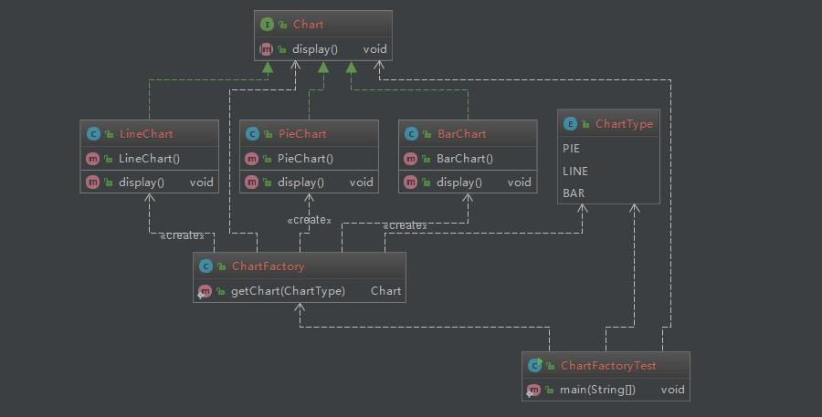

# 工厂方法 Factory Method 
___

### Intent

定义一个接口，但是让子类来决定哪个类的实例化,可以隐藏实例化的细节

### Explanation 

用工厂方法产生用户所需的产品，同时向客户隐藏了哪种具体类被实例化这一细节，用户只关心所需产品对应的工厂，无需关心创建细节

<div align="center">  </div><br>

* Chart interface

```java

public interface Chart {
    // display chart
    void display();
}
```
* BarChart
```java
public class BarChart implements Chart {

    public BarChart()
    {
        System.out.println("Create Bar Chart");
    }
    @Override
    public void display() {
        System.out.println( "Bar Chart display");
    }
}

```

*  PieChart 

```java
public class PieChart implements Chart {
    public PieChart()
    {
        System.out.println("Create Pie Chart");
    }
    @Override
    public void display() {
        System.out.println( "Pie Chart display");
    }
}
```
* LineChart

```java
public class LineChart implements Chart {

    public LineChart()
    {
        System.out.println("Create Line Chart");
    }
    @Override
    public void display() {
        System.out.println( "Line Chart display");
    }

}
```

```java
// factory class
public class ChartFactory {
    public static Chart getChart(ChartType type)
    {
        Chart chart = null;
        if(type == ChartType.BAR)
        {
            chart = new BarChart();
        }else if(type == ChartType.PIE)
        {
            chart = new PieChart();
        }else if(type == ChartType.LINE)
        {
            chart = new LineChart();
        }
        return chart;
    }
}
```

* Test class
```java
public class ChartFactoryTest {
    public static void main(String[] args) {
        Chart chart = null;
        for(ChartType type : ChartType.values())
        {
            chart = ChartFactory.getChart(type);
            chart.display();
        }
    }
}
```