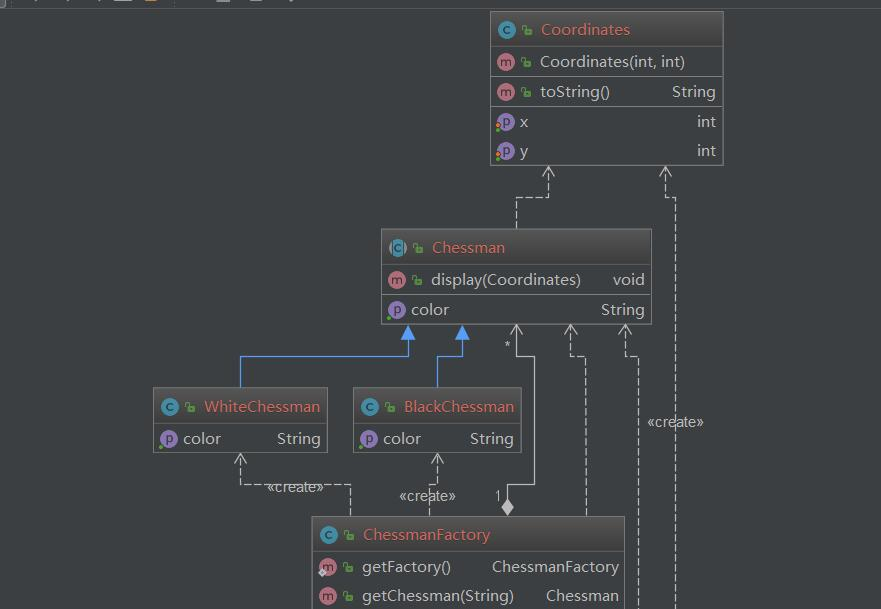

# FlyWeight
___

## Intent

使用共享来高效的支持大量细粒度对象

## Explanation
通过共享尽可能多的相似对象来最小化内存的使用或者计算上的花费

## Example
围棋的黑子和白子，围棋中有大量的黑子和白子，黑子和白子除了颜色、位置不同其他的都一模一样

## UML
<div align="center">  </div><br>

## code
```java

	public abstract class Chessman {
	    public abstract String getColor();
	    public void display(Coordinates coordinates)
	    {
	        System.out.println("the color of chessman is: " + this.getColor() +", Coordinates are:" + coordinates.toString());
	    }
	}
	
	public class BlackChessman extends Chessman {
	    @Override
	    public String getColor() {
	        return "Black";
	    }
	}
	
	
	package DesignPattern.FlyWeight;
	
	public class WhiteChessman extends Chessman {
	
	    @Override
	    public String getColor() {
	        return "White";
	    }
	}
```

```java
	package DesignPattern.FlyWeight;
	
	public class Coordinates {
	    private int x;
	    private int y;
	
	    public Coordinates(int x, int y)
	    {
	        this.x = x;
	        this.y = y;
	
	    }
	
	    public void setX(int x) {
	        this.x = x;
	    }
	
	    public int getX() {
	        return x;
	    }
	
	    public void setY(int y) {
	        this.y = y;
	    }
	
	    public int getY() {
	        return y;
	    }
	
	    @Override
	    public String toString() {
	        return "(" + this.x + "," + this.y +")";
	    }
	}

```
```java
	package DesignPattern.FlyWeight;
	
	import java.util.HashMap;
	
	public class ChessmanFactory {
	    private static ChessmanFactory factory = new ChessmanFactory();
	    private static HashMap<String, Chessman>  ht;
	    private ChessmanFactory()
	    {
	        ht = new HashMap<>();
	        Chessman black, white;
	        black = new BlackChessman();
	        white = new WhiteChessman();
	        ht.put("b", black);
	        ht.put("w", white);
	    }
	
	    public static ChessmanFactory getFactory() {
	        return factory;
	    }
	
	    public  Chessman getChessman(String color)
	    {
	        return ht.getOrDefault(color, null);
	    }
	}


```

## Test

```java

package DesignPattern.FlyWeight;

public class ChessmanFactoryDemo {
    public static void main(String[] args) {
        Chessman b1, b2, b3,w1, w2;
        ChessmanFactory factory = ChessmanFactory.getFactory();
        b1 = factory.getChessman("b");
        b2 = factory.getChessman("b");
        b3 = factory.getChessman("b");
        w1 = factory.getChessman("w");
        w2 = factory.getChessman("w");
        System.out.println(b1 == b2);
        System.out.println(w1 == w2);

        b1.display(new Coordinates(1,2));
        b2.display(new Coordinates(1,3));
        b3.display(new Coordinates(2,2));
        w1.display(new Coordinates(2,3));
        w2.display(new Coordinates(3,4));

    }
}

output:


```

## output
- true
- true
- the color of chessman is: Black, Coordinates are:(1,2)
- the color of chessman is: Black, Coordinates are:(1,3)
- the color of chessman is: Black, Coordinates are:(2,2)
- the color of chessman is: White, Coordinates are:(2,3)
- the color of chessman is: White, Coordinates are:(3,4)

## 应用

- java.lang.Integer#valueOf(int)  /Byte/Character/Short/Long 缓存少量常用的对象例如 Interger.cache--> [-128,127] 

## 参考文献
[flyweight](https://java-design-patterns.com/patterns/flyweight/)