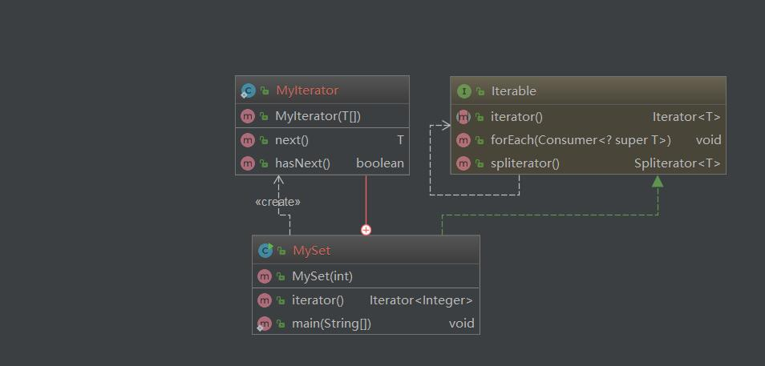

# 迭代器模式 Iterator Pattern
___

## Intent

提供了一种方式来访问聚合对象的内部元素，而不用公开其内部表示

## UML
<div align="center">  </div><br>


## Code
```java
public class MySet implements Iterable<Integer> {
    private Integer[] vals;
    private Random random;
    public MySet(int size)
    {
        random = new Random();
        vals = new Integer[size];
        for (int i = 0; i < size; i++) {
            vals[i] = Integer.valueOf(random.nextInt(100));
        }
    }
    @Override
    public Iterator<Integer> iterator() {
        return new MyIterator<>(this.vals);
    }

    public static class MyIterator<T> implements Iterator<T>
    {
        private T[] items;
        private int idx = 0;
        public MyIterator(T[] items)
        {
            this.items = items;
        }
        @Override
        public T next() {
            if(idx == items.length)throw new ArrayIndexOutOfBoundsException();
            return items[idx++];
        }

        @Override
        public boolean hasNext() {
            return idx < items.length;
        }
    }

    public static void main(String[] args) {
        MySet mySet = new MySet(20);
        Iterator<Integer> iterator = mySet.iterator();
        while (iterator.hasNext())
        {
            System.out.println(iterator.next());
        }

    }
}

```

## 应用

- 访问聚合对象的内部元素，而不用公开其内部表示
- 为遍历不同的聚合对象提供统一的接口


## 参考文献

- [java-design-patterns.com](https://java-design-patterns.com/patterns/iterator/)
- [IteratorPattern](https://openhome.cc/Gossip/DesignPattern/IteratorPattern.htm)