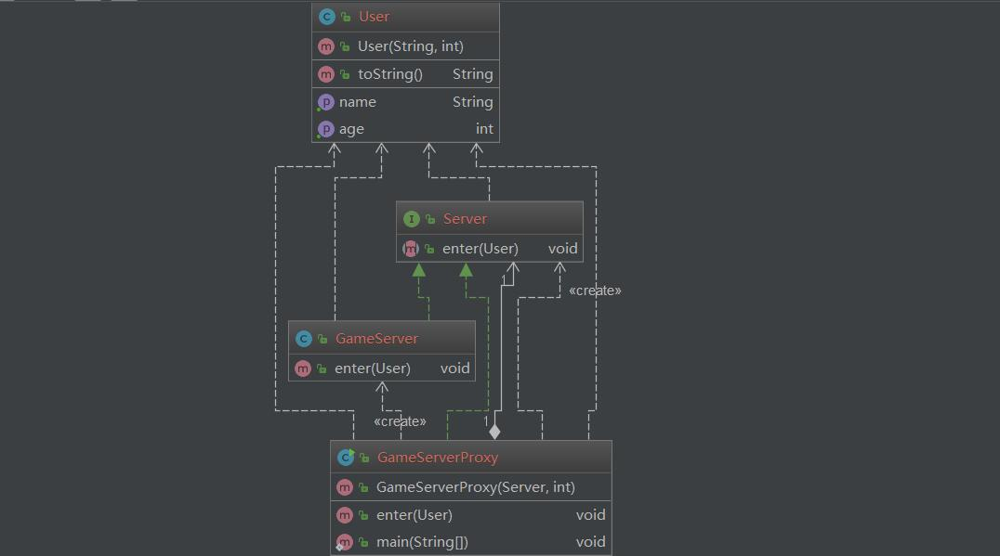

# 代理模式 Proxy
____

## Intent

> 为另一个对象提供一个代理来控制对它的访问。

## UML

<div align="center">  </div><br>

## Code

```java

public interface Server {

    void enter(User user);
}


public class GameServer implements Server {
    private static final Logger logger = Logger.getLogger(GameServer.class.getName());
    @Override
    public void enter(User user) {
        logger.info( user + "enters the server");
    }
}


public class User {
    private final String name;
    private final int age;
    public User(String name, int age)
    {
        this.name = name;
        this.age = age;
    }

    public String getName() {
        return name;
    }

    public int getAge() {
        return age;
    }

    @Override
    public String toString() {
        return "(" + name + ", " + age + ")";
    }
}


public class GameServerProxy implements Server {
    private static final Logger logger = Logger.getLogger(GameServerProxy.class.getName());
    private final int numsAllowed;
    private int currNums;
    private Server gameServer;
    private static final int Age_Allowed = 18;
    public GameServerProxy(Server gameServer, int numsAllowed)
    {
        this.gameServer = gameServer;
        this.numsAllowed = numsAllowed;
    }
    @Override
    public void enter(User user) {
        if(user.getAge() < 18)
        {
            logger.info(user.toString() + " is a child, who is not allowed enter the game server");
            return;
        }
        if(currNums >= numsAllowed)
        {
            logger.info(user.toString() + " too many users, you are not allowed enter the game server");
            return;
        }
        gameServer.enter(user);
        currNums++;

    }

    public static void main(String[] args) {

        Server server = new GameServer();
        Server proxy = new GameServerProxy(server, 3);

        User user = new User("tom",10);
        User user1 = new User("lily", 20);
        User user2 = new User("alice", 30);
        User user3 = new User("jason", 40);
        User user4 = new User("Park", 30);
        proxy.enter(user);
        proxy.enter(user1);
        proxy.enter(user2);
        proxy.enter(user3);
        proxy.enter(user4);
    }
}


```
## output

- 一月 27, 2019 6:35:06 下午 DesignPattern.Proxy.GameServerProxy enter
- 信息: (tom, 10) is a child, who is not allowed enter the game server
- 一月 27, 2019 6:35:06 下午 DesignPattern.Proxy.GameServer enter
- 信息: (lily, 20)enters the server
- 一月 27, 2019 6:35:06 下午 DesignPattern.Proxy.GameServer enter
- 信息: (alice, 30)enters the server
- 一月 27, 2019 6:35:06 下午 DesignPattern.Proxy.GameServer enter
- 信息: (jason, 40)enters the server
- 一月 27, 2019 6:35:06 下午 DesignPattern.Proxy.GameServerProxy enter
- 信息: (Park, 30) too many users, you are not allowed enter the game server


## 应用

- 访问控制
- 延迟初始化
- 实现登陆
- 助力网络连接
## 参考文献

[proxy](https://java-design-patterns.com/patterns/proxy/)