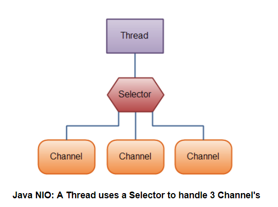

源自[CyC2018](https://github.com/CyC2018/CS-Notes)
<!-- GFM-TOC -->
* [一、概览](#一概览)
* [二、磁盘操作](#二磁盘操作)
* [三、字节操作](#三字节操作)
    * [实现文件复制](#实现文件复制)
    * [装饰者模式](#装饰者模式)
* [四、字符操作](#四字符操作)
    * [编码与解码](#编码与解码)
    * [String 的编码方式](#string-的编码方式)
    * [Reader 与 Writer](#reader-与-writer)
    * [实现逐行输出文本文件的内容](#实现逐行输出文本文件的内容)
* [五、对象操作](#五对象操作)
    * [序列化](#序列化)
    * [Serializable](#serializable)
    * [transient](#transient)
* [六、网络操作](#六网络操作)
    * [InetAddress](#inetaddress)
    * [URL](#url)
    * [Sockets](#sockets)
    * [Datagram](#datagram)
* [七、NIO](#七nio)
    * [流与块](#流与块)
    * [通道与缓冲区](#通道与缓冲区)
    * [缓冲区状态变量](#缓冲区状态变量)
    * [文件 NIO 实例](#文件-nio-实例)
    * [选择器](#选择器)
    * [套接字 NIO 实例](#套接字-nio-实例)
    * [内存映射文件](#内存映射文件)
    * [对比](#对比)
* [八、参考资料](#八参考资料)
<!-- GFM-TOC -->


# 一、概览

Java 的 I/O 大概可以分成以下几类：

- 磁盘操作：File
- 字节操作：InputStream 和 OutputStream
- 字符操作：Reader 和 Writer
- 对象操作：Serializable
- 网络操作：Socket
- 新的输入/输出：NIO

# 二、磁盘操作
## File 
File 类可以用于表示文件和目录的信息，但是它不表示文件的内容。
### 1. Create File:
javo.io.File 类可以用来创建新的文件。实例化File 对象，然后调用createNewFile()

```java
 public class CreateFile {

    public static void main(String[] args) throws IOException {
        // use system property file.separator to make our program cross-platform.
        String fileSep = System.getProperty("file.separator");
        method1("text1.txt", "1,2,3,4,5");   // writer
        method2("text2.txt", "1,2,3,4,5");   // output stream
        method3("text3.txt", "6,7,8,9,10");  // nio

    }

    public  static void method1(String filename, String data)
    {
        File file = new File(filename);

        try
        {
            if(!file.exists())
            {
                boolean hasSuccess = file.createNewFile();
                if(hasSuccess)
                {
                    System.out.println("Created file: " + filename);
                }else {
                    System.out.println("File already exists: " + filename);
                }
            }

            try(Writer writer = new FileWriter(file))
            {
                writer.write(data);
                writer.flush();
            }


        }catch (IOException ex)
        {
            ex.printStackTrace();
        }


    }

    public static void method2(String filename, String data) throws IOException
    {
        try(FileOutputStream outputStream = new FileOutputStream(filename))
        {
            outputStream.write(data.getBytes());
            outputStream.flush();  // flush the data to file
        }

    }

    public static void method3(String filename, String data) throws IOException
    {
        Files.write(Paths.get(filename), data.getBytes());
    }
}

```


### 2. Recursive Print FileName：

```java
public static void listAllFiles(File dir) {
    if (dir == null || !dir.exists()) {
        return;
    }
    if (dir.isFile()) {
        System.out.println(dir.getName());
        return;
    }
    for (File file : dir.listFiles()) {
        listAllFiles(file);
    }
}

```
### 3. Recursive Delete File
```java
 public static void recursiveDelete(File file)
    {
        // no file exists
        if(file == null ||  !file.exists())return;

        // recursive delete all the file in this directory
        if(file.isDirectory())
        {
            for(File f: file.listFiles())
            {
                recursiveDelete(f);
            }
        }
        // delete this file
        file.delete();
        System.out.println("delete file: " + file.getAbsolutePath());
    }
```

### 4. Rename File
rename a file or move a file
```
  public class FileRename {

    public static void main(String[] args) {

        File source = new File("text1.txt");
        File target = new File("text11.md");
        if(source.renameTo(target))
        {
            System.out.println("rename succeed");
        }else {
            System.out.println("rename failed");
        }

        source = new File("text11.md");
        target = new File("D:/text11.md");
        if(source.renameTo(target))
        {
            System.out.println("rename succeed");
        }else {
            System.out.println("rename failed");
        }

    }
}
```

### 5. File Size
 File.length() /channel.size()/FileUtils.sizeof(file)
```
public class GetFileSize {


    // by File instance
    // The length, in bytes, of the file denoted by this abstract pathname, or <code>0L</code> if the file does not exist.
    public static long getFileSize(File file)
    {
        return file.length();
    }

    // by channel instance
    public static long getFileSize(Path path)
    {
        long fileSize = 0L;
        try{
            FileChannel channel = FileChannel.open(path);
            fileSize = channel.size();
            channel.close();
        }catch (IOException ex)
        {
            ex.printStackTrace();
        }
        return fileSize;
    }

    public static long getFileSize(String fileName)
    {
        File file = new File(fileName);
        return FileUtils.sizeOf(file);
    }


    public static void main(String[] args) {

        System.out.println(getFileSize(new File("text.txt")));
        System.out.println(getFileSize(Paths.get("text.txt")));
        System.out.println(getFileSize("text.txt"));
    }
}

```
### 6. FileNameFilter

Java FileNameFilter 接口 有 boolean accept(File dir, String name) 方法，if accept, then we can add this file to list


```
public class FileNameFilterDemo {

    public static void main(String[] args) {
        File file = new File("D:/demo");
        String ext = "txt";
        File[] files = file.listFiles(new FilenameFilter() {
            @Override
            public boolean accept(File dir, String name) {
                return name.toLowerCase().endsWith(ext);
            }
        });

        for(File f: files)
        {
            System.out.println(f.getAbsolutePath());
        }
        System.out.println("*******************");

         files = file.listFiles((d,s) -> s.toLowerCase().endsWith(ext) );
        for(File f: files)
        {
            System.out.println(f.getAbsolutePath());
        }

    }
}
```
从 Java7 开始，可以使用 Paths 和 Files 代替 File。

# 三、字节操作

## 实现文件复制
### Steam /Channel/ Apache Commons IO/Files

```java
  public class CopyFile {

    public static void copyFileBySteam(File source, File target)  throws IOException
    {
        InputStream in = null;
        OutputStream out = null;
        try
        {
            in = new FileInputStream(source);
            out = new FileOutputStream(target);
            byte[] buffer = new byte[20*1024];
            int length;
            while ((length = in.read(buffer)) > 0)
            {
                out.write(buffer, 0, length);

            }
            out.flush();
        }finally {
            in.close();
            out.close();
        }
    }


    public static void copyFileByChannel(File source, File target) throws IOException
    {
        FileChannel in = null;
        FileChannel out = null;
        try
        {
            in = new FileInputStream(source).getChannel();
            out = new FileOutputStream(target).getChannel();
            out.transferFrom(in, 0,  in.size());
        }finally {
            in.close();
            out.close();
        }
    }

    public static void copyFileByCommonsIo(File source, File target) throws IOException
    {
        FileUtils.copyFile(source, target);
    }


    public static void copyFileByFiles(File source, File target) throws IOException
    {
        Files.copy(source.toPath(), target.toPath());
    }

    public static void testCopy(File source, File target, String name) throws IOException
    {
        try
        {
            // get the copy file method 
            Method method = CopyFile.class.getMethod(name, File.class,File.class);
            long t1 = System.nanoTime();
            // static method , so the obj is null
            method.invoke(null, source, target);
            long t2 = System.nanoTime();
            System.out.println(String.format("MethodName: {%20s} Cost time: {%s}", name, (t2 - t1)));
            target.delete();

        }catch (NoSuchMethodException ex)
        {
            ex.printStackTrace();
            System.out.println(ex.getMessage());
        }catch (IllegalAccessException ex)
        {
            System.out.println(ex.getMessage());
            ex.printStackTrace();
        }catch (InvocationTargetException ex)
        {
            System.out.println(ex.getMessage());
            ex.printStackTrace();
        }
    }

    public static void main(String[] args) throws IOException {

        File source = new File("D:\\haiwang.mp4");
        File target = new File("F:\\haiwang.mp4");

        testCopy(source, target, "copyFileBySteam");
        testCopy(source, target, "copyFileByChannel");
        testCopy(source, target, "copyFileByCommonsIo");
        testCopy(source, target, "copyFileByFiles");

    }
}


output:
MethodName: {     copyFileBySteam} Cost time: {10831121084}
MethodName: {   copyFileByChannel} Cost time: {10150842610}
MethodName: { copyFileByCommonsIo} Cost time: {9178643924}
MethodName: {     copyFileByFiles} Cost time: {7420124934}

初步测试： copyFileByFiles method 更快一点

将 byte[] buffer = new byte[20*1024]; 改为byte[] buffer = new byte[50*1024]; 对于大文件增加buffer的值copyFileBySteam 的性能可以进一步提升
MethodName: {     copyFileBySteam} Cost time: {9374476484}
MethodName: {   copyFileByChannel} Cost time: {11682364988}
MethodName: { copyFileByCommonsIo} Cost time: {9932202628}
MethodName: {     copyFileByFiles} Cost time: {7373096424}

```
### File separator,separatorChar,pathSeparator,pathSeparatorChar

```java
public class FileSeparator {
    public static void main(String[] args) {
        System.out.println("File.separator = " + File.separator);
        System.out.println("File.separatorChar = " + File.separatorChar);
        System.out.println("File.pathSeparator = " + File.pathSeparator);
        System.out.println("File.pathSeparatorChar = " + File.pathSeparatorChar);
//platform independent and safe to use across Unix and Windows
        File fileSafe = new File("tmp"+File.separator+"abc.txt");
    }
}
```
windows:
```html
File.separator = \
File.separatorChar = \
File.pathSeparator = ;
File.pathSeparatorChar = ;
```
linux
```html
File.separator = /
File.separatorChar = /
File.pathSeparator = :
File.pathSeparatorChar = :
```
### Read File 
 读取文本文件可以使用 Files/FileReader/BufferedReader/scanner/Apache commons IO
```java

public class ReadFile {

    public static void readByFileReader(String fileName) throws  IOException
    {
        System.out.println("Read By File Reader:");
        File file  = new File(fileName);
        try(BufferedReader reader = new BufferedReader(new FileReader(file)))
        {
            String line = null;
            while ((line = reader.readLine()) != null)
            {
                // handle this line
                System.out.println(line);
            }
        }
    }

   public static void readByBufferedReader(String fileName, Charset charset) throws IOException
   {
       File file = new File(fileName);
       System.out.println("Read file By Buffered Reader: ");
       try(BufferedReader reader = new BufferedReader(new InputStreamReader(new FileInputStream(file), charset)))
       {
           String line = null;
           while ((line = reader.readLine()) != null)
           {
               // handle this line
               System.out.println(line);
           }
       }
   }

   public static void readByBufferedReaderJava7(String fileName, Charset charset) throws IOException
   {

       System.out.println("Read file By Buffered Reader in Java 7: ");
       Path path = Paths.get(fileName);
       try(BufferedReader reader = Files.newBufferedReader(path, charset))
       {
           String line = null;
           while ((line = reader.readLine()) != null)
           {
               // handle this line
               System.out.println(line);
           }
       }
   }

   public static void readByScanner(String fileName, String charsetName) throws IOException
   {
       System.out.println("Read file By Scanner: ");
       Path path = Paths.get(fileName);
       try(Scanner scanner = new Scanner(path, charsetName))
       {
           String line = null;
           while (scanner.hasNextLine())
           {
               line = scanner.nextLine();
               // handle this line;
               System.out.println(line);
           }
       }
   }

   public static void readByFiles(String fileName) throws IOException
   {
       Path path = Paths.get(fileName);
       List<String> allLines = Files.readAllLines(path, StandardCharsets.UTF_8);
       System.out.println(allLines);

   }

   public static void readByApacheCommons(String fileName) throws IOException
   {
       List<String> allLines = FileUtils.readLines(new File(fileName), StandardCharsets.UTF_8);
       System.out.println(allLines);
   }


    public static void main(String[] args) throws IOException {
        readByApacheCommons("text.txt");
    }
}

```

## 装饰者模式

Java I/O 使用了装饰者模式来实现。以 InputStream 为例，

- InputStream 是抽象组件；
- FileInputStream 是 InputStream 的子类，属于具体组件，提供了字节流的输入操作；
- FilterInputStream 属于抽象装饰者，装饰者用于装饰组件，为组件提供额外的功能。例如 BufferedInputStream 为 FileInputStream 提供缓存的功能。

<div align="center">  </div><br>

实例化一个具有缓存功能的字节流对象时，只需要在 FileInputStream 对象上再套一层 BufferedInputStream 对象即可。

```java
FileInputStream fileInputStream = new FileInputStream(filePath);
BufferedInputStream bufferedInputStream = new BufferedInputStream(fileInputStream);
```

DataInputStream 装饰者提供了对更多数据类型进行输入的操作，比如 int、double 等基本类型。

# 四、字符操作

## 编码与解码

编码就是把字符转换为字节，而解码是把字节重新组合成字符。

如果编码和解码过程使用不同的编码方式那么就出现了乱码。

- GBK 编码中，中文字符占 2 个字节，英文字符占 1 个字节；
- UTF-8 编码中，中文字符占 3 个字节，英文字符占 1 个字节；
- UTF-16be 编码中，中文字符和英文字符都占 2 个字节。

UTF-16be 中的 be 指的是 Big Endian，也就是大端。相应地也有 UTF-16le，le 指的是 Little Endian，也就是小端。

Java 的内存编码使用双字节编码 UTF-16be，这不是指 Java 只支持这一种编码方式，而是说 char 这种类型使用 UTF-16be 进行编码。char 类型占 16 位，也就是两个字节，Java 使用这种双字节编码是为了让一个中文或者一个英文都能使用一个 char 来存储。

## String 的编码方式

String 可以看成一个字符序列，可以指定一个编码方式将它编码为字节序列，也可以指定一个编码方式将一个字节序列解码为 String。

```java
String str1 = "中文";
byte[] bytes = str1.getBytes("UTF-8");
String str2 = new String(bytes, "UTF-8");
System.out.println(str2);
```

在调用无参数 getBytes() 方法时，默认的编码方式不是 UTF-16be。双字节编码的好处是可以使用一个 char 存储中文和英文，而将 String 转为 bytes[] 字节数组就不再需要这个好处，因此也就不再需要双字节编码。getBytes() 的默认编码方式与平台有关，一般为 UTF-8。

```java
byte[] bytes = str1.getBytes();
```

## Reader 与 Writer

不管是磁盘还是网络传输，最小的存储单元都是字节，而不是字符。但是在程序中操作的通常是字符形式的数据，因此需要提供对字符进行操作的方法。

- InputStreamReader 实现从字节流解码成字符流；
- OutputStreamWriter 实现字符流编码成为字节流。

## 实现逐行输出文本文件的内容

```java
public static void readFileContent(String filePath) throws IOException {

    FileReader fileReader = new FileReader(filePath);
    BufferedReader bufferedReader = new BufferedReader(fileReader);

    String line;
    while ((line = bufferedReader.readLine()) != null) {
        System.out.println(line);
    }

    // 装饰者模式使得 BufferedReader 组合了一个 Reader 对象
    // 在调用 BufferedReader 的 close() 方法时会去调用 Reader 的 close() 方法
    // 因此只要一个 close() 调用即可
    bufferedReader.close();
}
```

# 五、对象操作

## 序列化

序列化就是将一个对象转换成字节序列，方便存储和传输。

- 序列化：ObjectOutputStream.writeObject()
- 反序列化：ObjectInputStream.readObject()

不会对静态变量进行序列化，因为序列化只是保存对象的状态，静态变量属于类的状态。

## Serializable

序列化的类需要实现 Serializable 接口，它只是一个标准，没有任何方法需要实现，但是如果不去实现它的话而进行序列化，会抛出异常。

```java
public static void main(String[] args) throws IOException, ClassNotFoundException {

    A a1 = new A(123, "abc");
    String objectFile = "file/a1";

    ObjectOutputStream objectOutputStream = new ObjectOutputStream(new FileOutputStream(objectFile));
    objectOutputStream.writeObject(a1);
    objectOutputStream.close();

    ObjectInputStream objectInputStream = new ObjectInputStream(new FileInputStream(objectFile));
    A a2 = (A) objectInputStream.readObject();
    objectInputStream.close();
    System.out.println(a2);
}

private static class A implements Serializable {

    private int x;
    private String y;

    A(int x, String y) {
        this.x = x;
        this.y = y;
    }

    @Override
    public String toString() {
        return "x = " + x + "  " + "y = " + y;
    }
}
```

## transient

transient 关键字可以使一些属性不会被序列化。

ArrayList 中存储数据的数组 elementData 是用 transient 修饰的，因为这个数组是动态扩展的，并不是所有的空间都被使用，因此就不需要所有的内容都被序列化。通过重写序列化和反序列化方法，使得可以只序列化数组中有内容的那部分数据。

```java
private transient Object[] elementData;
```

# 六、网络操作

Java 中的网络支持：

- InetAddress：用于表示网络上的硬件资源，即 IP 地址；
- URL：统一资源定位符；
- Sockets：使用 TCP 协议实现网络通信；
- Datagram：使用 UDP 协议实现网络通信。

## InetAddress

没有公有的构造函数，只能通过静态方法来创建实例。

```java
InetAddress.getByName(String host);
InetAddress.getByAddress(byte[] address);
```

## URL

可以直接从 URL 中读取字节流数据。

```java
public static void main(String[] args) throws IOException {

    URL url = new URL("http://www.baidu.com");

    /* 字节流 */
    InputStream is = url.openStream();

    /* 字符流 */
    InputStreamReader isr = new InputStreamReader(is, "utf-8");

    /* 提供缓存功能 */
    BufferedReader br = new BufferedReader(isr);

    String line;
    while ((line = br.readLine()) != null) {
        System.out.println(line);
    }

    br.close();
}
```

## Sockets

- ServerSocket：服务器端类
- Socket：客户端类
- 服务器和客户端通过 InputStream 和 OutputStream 进行输入输出。

<div align="center">  </div><br>

## Datagram

- DatagramSocket：通信类
- DatagramPacket：数据包类

# 七、NIO

新的输入/输出 (NIO) 库是在 JDK 1.4 中引入的，弥补了原来的 I/O 的不足，提供了高速的、面向块的 I/O。

## 流与块

I/O 与 NIO 最重要的区别是数据打包和传输的方式，I/O 以流的方式处理数据，而 NIO 以块的方式处理数据。

面向流的 I/O 一次处理一个字节数据：一个输入流产生一个字节数据，一个输出流消费一个字节数据。为流式数据创建过滤器非常容易，链接几个过滤器，以便每个过滤器只负责复杂处理机制的一部分。不利的一面是，面向流的 I/O 通常相当慢。

面向块的 I/O 一次处理一个数据块，按块处理数据比按流处理数据要快得多。但是面向块的 I/O 缺少一些面向流的 I/O 所具有的优雅性和简单性。

I/O 包和 NIO 已经很好地集成了，java.io.\* 已经以 NIO 为基础重新实现了，所以现在它可以利用 NIO 的一些特性。例如，java.io.\* 包中的一些类包含以块的形式读写数据的方法，这使得即使在面向流的系统中，处理速度也会更快。

## 通道与缓冲区

### 1. 通道

通道 Channel 是对原 I/O 包中的流的模拟，可以通过它读取和写入数据。

通道与流的不同之处在于，流只能在一个方向上移动(一个流必须是 InputStream 或者 OutputStream 的子类)，而通道是双向的，可以用于读、写或者同时用于读写。

通道包括以下类型：

- FileChannel：从文件中读写数据；
- DatagramChannel：通过 UDP 读写网络中数据；
- SocketChannel：通过 TCP 读写网络中数据；
- ServerSocketChannel：可以监听新进来的 TCP 连接，对每一个新进来的连接都会创建一个 SocketChannel。

### 2. 缓冲区

发送给一个通道的所有数据都必须首先放到缓冲区中，同样地，从通道中读取的任何数据都要先读到缓冲区中。也就是说，不会直接对通道进行读写数据，而是要先经过缓冲区。

缓冲区实质上是一个数组，但它不仅仅是一个数组。缓冲区提供了对数据的结构化访问，而且还可以跟踪系统的读/写进程。

缓冲区包括以下类型：

- ByteBuffer
- CharBuffer
- ShortBuffer
- IntBuffer
- LongBuffer
- FloatBuffer
- DoubleBuffer

## 缓冲区状态变量

- capacity：最大容量；
- position：当前已经读写的字节数；
- limit：还可以读写的字节数。

状态变量的改变过程举例：

① 新建一个大小为 8 个字节的缓冲区，此时 position 为 0，而 limit = capacity = 8。capacity 变量不会改变，下面的讨论会忽略它。

<div align="center">  </div><br>

② 从输入通道中读取 5 个字节数据写入缓冲区中，此时 position 为 5，limit 保持不变。

<div align="center">  </div><br>

③ 在将缓冲区的数据写到输出通道之前，需要先调用 flip() 方法，这个方法将 limit 设置为当前 position，并将 position 设置为 0。

<div align="center">  </div><br>

④ 从缓冲区中取 4 个字节到输出缓冲中，此时 position 设为 4。

<div align="center">  </div><br>

⑤ 最后需要调用 clear() 方法来清空缓冲区，此时 position 和 limit 都被设置为最初位置。

<div align="center">  </div><br>

## 文件 NIO 实例

以下展示了使用 NIO 快速复制文件的实例：

```java
public static void fastCopy(String src, String dist) throws IOException {

    /* 获得源文件的输入字节流 */
    FileInputStream fin = new FileInputStream(src);

    /* 获取输入字节流的文件通道 */
    FileChannel fcin = fin.getChannel();

    /* 获取目标文件的输出字节流 */
    FileOutputStream fout = new FileOutputStream(dist);

    /* 获取输出字节流的文件通道 */
    FileChannel fcout = fout.getChannel();

    /* 为缓冲区分配 1024 个字节 */
    ByteBuffer buffer = ByteBuffer.allocateDirect(1024);

    while (true) {

        /* 从输入通道中读取数据到缓冲区中 */
        int r = fcin.read(buffer);

        /* read() 返回 -1 表示 EOF */
        if (r == -1) {
            break;
        }

        /* 切换读写 */
        buffer.flip();

        /* 把缓冲区的内容写入输出文件中 */
        fcout.write(buffer);

        /* 清空缓冲区 */
        buffer.clear();
    }
}
```

## 选择器

NIO 常常被叫做非阻塞 IO，主要是因为 NIO 在网络通信中的非阻塞特性被广泛使用。

NIO 实现了 IO 多路复用中的 Reactor 模型，一个线程 Thread 使用一个选择器 Selector 通过轮询的方式去监听多个通道 Channel 上的事件，从而让一个线程就可以处理多个事件。

通过配置监听的通道 Channel 为非阻塞，那么当 Channel 上的 IO 事件还未到达时，就不会进入阻塞状态一直等待，而是继续轮询其它 Channel，找到 IO 事件已经到达的 Channel 执行。

因为创建和切换线程的开销很大，因此使用一个线程来处理多个事件而不是一个线程处理一个事件，对于 IO 密集型的应用具有很好地性能。

应该注意的是，只有套接字 Channel 才能配置为非阻塞，而 FileChannel 不能，为 FileChannel 配置非阻塞也没有意义。

<div align="center">  </div><br>

### 1. 创建选择器

```java
Selector selector = Selector.open();
```

### 2. 将通道注册到选择器上

```java
ServerSocketChannel ssChannel = ServerSocketChannel.open();
ssChannel.configureBlocking(false);
ssChannel.register(selector, SelectionKey.OP_ACCEPT);
```

通道必须配置为非阻塞模式，否则使用选择器就没有任何意义了，因为如果通道在某个事件上被阻塞，那么服务器就不能响应其它事件，必须等待这个事件处理完毕才能去处理其它事件，显然这和选择器的作用背道而驰。

在将通道注册到选择器上时，还需要指定要注册的具体事件，主要有以下几类：

- SelectionKey.OP_CONNECT
- SelectionKey.OP_ACCEPT
- SelectionKey.OP_READ
- SelectionKey.OP_WRITE

它们在 SelectionKey 的定义如下：

```java
public static final int OP_READ = 1 << 0;
public static final int OP_WRITE = 1 << 2;
public static final int OP_CONNECT = 1 << 3;
public static final int OP_ACCEPT = 1 << 4;
```

可以看出每个事件可以被当成一个位域，从而组成事件集整数。例如：

```java
int interestSet = SelectionKey.OP_READ | SelectionKey.OP_WRITE;
```

### 3. 监听事件

```java
int num = selector.select();
```

使用 select() 来监听到达的事件，它会一直阻塞直到有至少一个事件到达。

### 4. 获取到达的事件

```java
Set<SelectionKey> keys = selector.selectedKeys();
Iterator<SelectionKey> keyIterator = keys.iterator();
while (keyIterator.hasNext()) {
    SelectionKey key = keyIterator.next();
    if (key.isAcceptable()) {
        // ...
    } else if (key.isReadable()) {
        // ...
    }
    keyIterator.remove();
}
```

### 5. 事件循环

因为一次 select() 调用不能处理完所有的事件，并且服务器端有可能需要一直监听事件，因此服务器端处理事件的代码一般会放在一个死循环内。

```java
while (true) {
    int num = selector.select();
    Set<SelectionKey> keys = selector.selectedKeys();
    Iterator<SelectionKey> keyIterator = keys.iterator();
    while (keyIterator.hasNext()) {
        SelectionKey key = keyIterator.next();
        if (key.isAcceptable()) {
            // ...
        } else if (key.isReadable()) {
            // ...
        }
        keyIterator.remove();
    }
}
```

## 套接字 NIO 实例

```java
public class NIOServer {

    public static void main(String[] args) throws IOException {

        Selector selector = Selector.open();

        ServerSocketChannel ssChannel = ServerSocketChannel.open();
        ssChannel.configureBlocking(false);
        ssChannel.register(selector, SelectionKey.OP_ACCEPT);

        ServerSocket serverSocket = ssChannel.socket();
        InetSocketAddress address = new InetSocketAddress("127.0.0.1", 8888);
        serverSocket.bind(address);

        while (true) {

            selector.select();
            Set<SelectionKey> keys = selector.selectedKeys();
            Iterator<SelectionKey> keyIterator = keys.iterator();

            while (keyIterator.hasNext()) {

                SelectionKey key = keyIterator.next();

                if (key.isAcceptable()) {

                    ServerSocketChannel ssChannel1 = (ServerSocketChannel) key.channel();

                    // 服务器会为每个新连接创建一个 SocketChannel
                    SocketChannel sChannel = ssChannel1.accept();
                    sChannel.configureBlocking(false);

                    // 这个新连接主要用于从客户端读取数据
                    sChannel.register(selector, SelectionKey.OP_READ);

                } else if (key.isReadable()) {

                    SocketChannel sChannel = (SocketChannel) key.channel();
                    System.out.println(readDataFromSocketChannel(sChannel));
                    sChannel.close();
                }

                keyIterator.remove();
            }
        }
    }

    private static String readDataFromSocketChannel(SocketChannel sChannel) throws IOException {

        ByteBuffer buffer = ByteBuffer.allocate(1024);
        StringBuilder data = new StringBuilder();

        while (true) {

            buffer.clear();
            int n = sChannel.read(buffer);
            if (n == -1) {
                break;
            }
            buffer.flip();
            int limit = buffer.limit();
            char[] dst = new char[limit];
            for (int i = 0; i < limit; i++) {
                dst[i] = (char) buffer.get(i);
            }
            data.append(dst);
            buffer.clear();
        }
        return data.toString();
    }
}
```

```java
public class NIOClient {

    public static void main(String[] args) throws IOException {
        Socket socket = new Socket("127.0.0.1", 8888);
        OutputStream out = socket.getOutputStream();
        String s = "hello world";
        out.write(s.getBytes());
        out.close();
    }
}
```

## 内存映射文件

内存映射文件 I/O 是一种读和写文件数据的方法，它可以比常规的基于流或者基于通道的 I/O 快得多。

向内存映射文件写入可能是危险的，只是改变数组的单个元素这样的简单操作，就可能会直接修改磁盘上的文件。修改数据与将数据保存到磁盘是没有分开的。

下面代码行将文件的前 1024 个字节映射到内存中，map() 方法返回一个 MappedByteBuffer，它是 ByteBuffer 的子类。因此，可以像使用其他任何 ByteBuffer 一样使用新映射的缓冲区，操作系统会在需要时负责执行映射。

```java
MappedByteBuffer mbb = fc.map(FileChannel.MapMode.READ_WRITE, 0, 1024);
```

## 对比

NIO 与普通 I/O 的区别主要有以下两点：

- NIO 是非阻塞的；
- NIO 面向块，I/O 面向流。

# 八、参考资料

- Eckel B, 埃克尔, 昊鹏, 等. Java 编程思想 [M]. 机械工业出版社, 2002.
- [IBM: NIO 入门](https://www.ibm.com/developerworks/cn/education/java/j-nio/j-nio.html)
- [Java NIO Tutorial](http://tutorials.jenkov.com/java-nio/index.html)
- [Java NIO 浅析](https://tech.meituan.com/nio.html)
- [IBM: 深入分析 Java I/O 的工作机制](https://www.ibm.com/developerworks/cn/java/j-lo-javaio/index.html)
- [IBM: 深入分析 Java 中的中文编码问题](https://www.ibm.com/developerworks/cn/java/j-lo-chinesecoding/index.html)
- [IBM: Java 序列化的高级认识](https://www.ibm.com/developerworks/cn/java/j-lo-serial/index.html)
- [NIO 与传统 IO 的区别](http://blog.csdn.net/shimiso/article/details/24990499)
- [Decorator Design Pattern](http://stg-tud.github.io/sedc/Lecture/ws13-14/5.3-Decorator.html#mode=document)
- [Socket Multicast](http://labojava.blogspot.com/2012/12/socket-multicast.html)
- [java-file-separator-separatorchar-pathseparator](https://www.journaldev.com/851/java-file-separator-separatorchar-pathseparator-pathseparatorchar)
